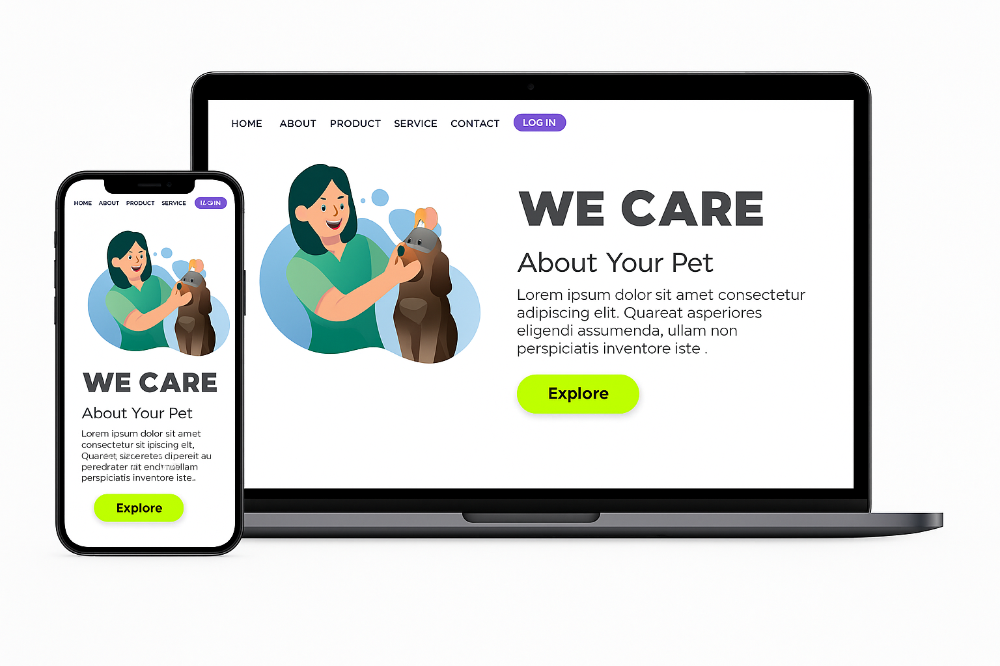

# Página Simples Pet Shop

Este é um projeto educacional desenvolvido com o objetivo de praticar conceitos fundamentais de HTML e CSS, incluindo estruturação de conteúdo, estilização e princípios de design responsivo. A página simula um site de cuidados com animais de estimação.

## Exemplo de Tela

Abaixo está uma imagem exemplificando o layout da página em telas de desktop e mobile:

# Descrição do Projeto

A Página Simples Pet Shop foi criada para oferecer uma experiência de navegação intuitiva e amigável para os amantes de animais de estimação. O projeto abrange:

- Estruturação de conteúdo com HTML
- Estilização utilizando CSS
- Implementação de design responsivo

# Tecnologias Utilizadas

- **HTML**: Para a estruturação do conteúdo.
- **CSS**: Para estilização e design responsivo.

# Contribuição

Sinta-se à vontade para contribuir com melhorias ou sugestões. Crie um fork do repositório, faça suas alterações e envie um pull request.

# Licença

Este projeto é de uso educacional e não possui uma licença específica. Sinta-se à vontade para utilizar e modificar conforme necessário.

# Contato

Para mais informações, entre em contato:

- **Nome**: Daniel Guimarães
- **Email**: leinadgp@gmail.com
- **Linkedin**: https://linkedin.com/in/danielguimaraespedrozo/
